# Setup Android Studio

Android Studio: [https://developer.android.com/studio](https://developer.android.com/studio)

After downloading, execute the installation file to install Android Studio.

#### Android Studio Configuration <a href="#android-studio-configuration" id="android-studio-configuration"></a>

you can see the screen like below after executing Android Studio installation file.

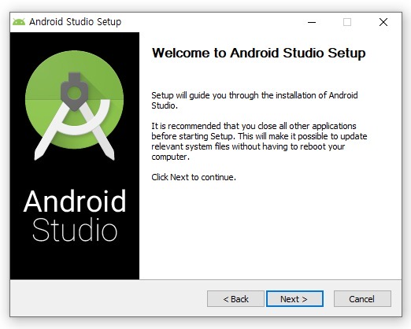

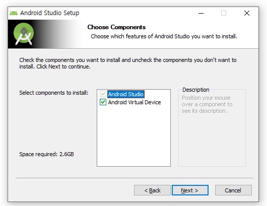

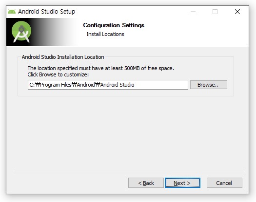


After installing, you can see the screen like below. Click Next button to complete Android Studio installation.

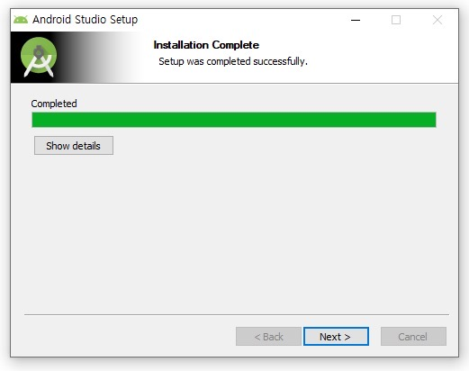

When you click Next button to complete the installation, you can see the screen like below. Check Start Android Studio and click Finish button to finish Android Studio installation.

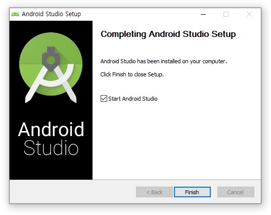

When you click Finish button, you can see Android Studio is executed like below. Select Do not import settings, and click OK button to execute Android Studio.


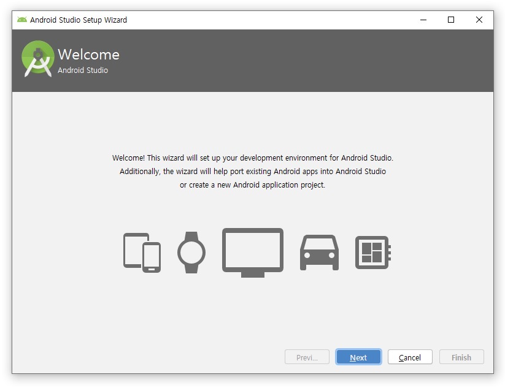

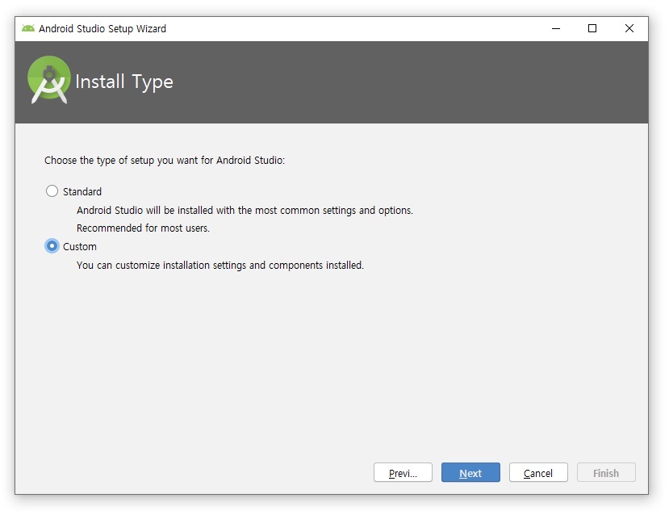

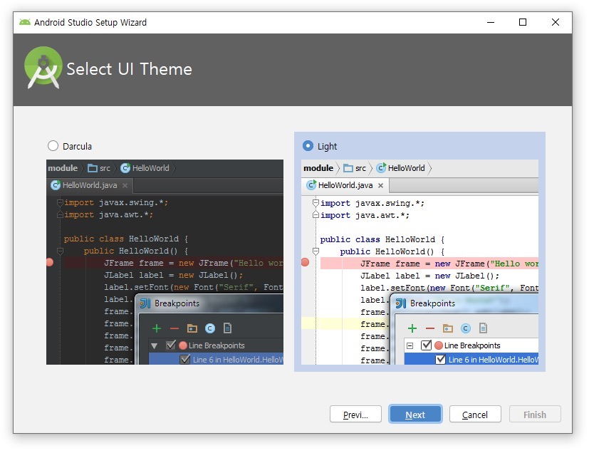

on the next screen, you can see Emulator Settings screen like below. Click Next button without any changing especially.

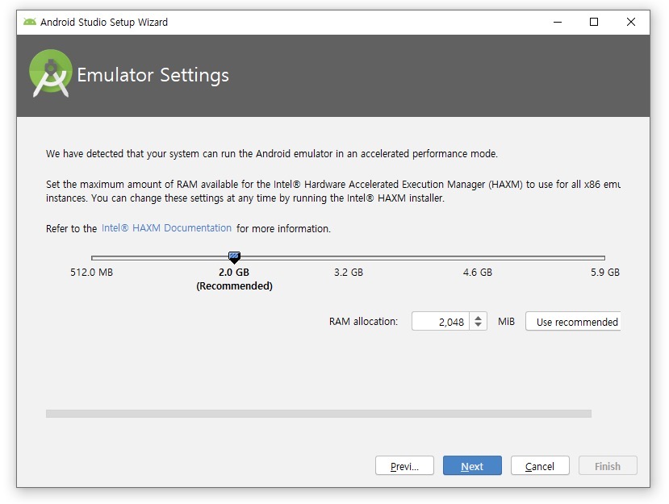

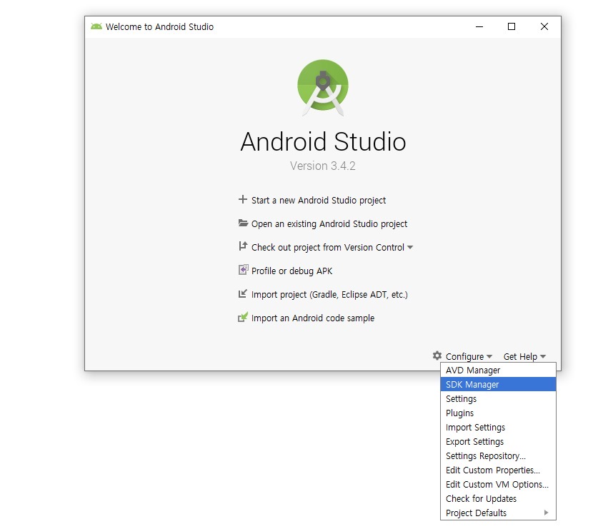

> #### Android Studio SDK Configuration <a href="#android-studio-sdk-configuration" id="android-studio-sdk-configuration"></a>
>
> Click `Configure > SDK Manger` menu on the right botton to go to Android SDK configuration.


1. Android SDK Platform 29
2. Intel x86 Atom System Image
3. Google APIs Intel x86 Atom System Image
4. Google APIs Intel x86 Atom\_64 System Image

If you select all options above, click OK button on the right bottom to install them.

> #### Configure Android Studio Environment Variable <a href="#configure-android-studio-environment-variable" id="configure-android-studio-environment-variable"></a>
>
> Android studio installation and configuration are done. Now, we need to set the environment variables. Right-click This PC and click Properties menu like below.

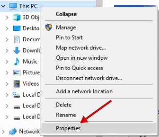

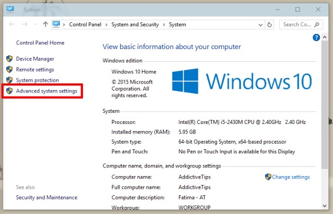

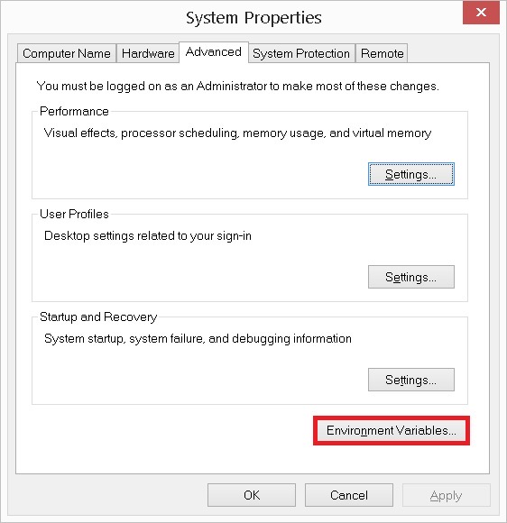


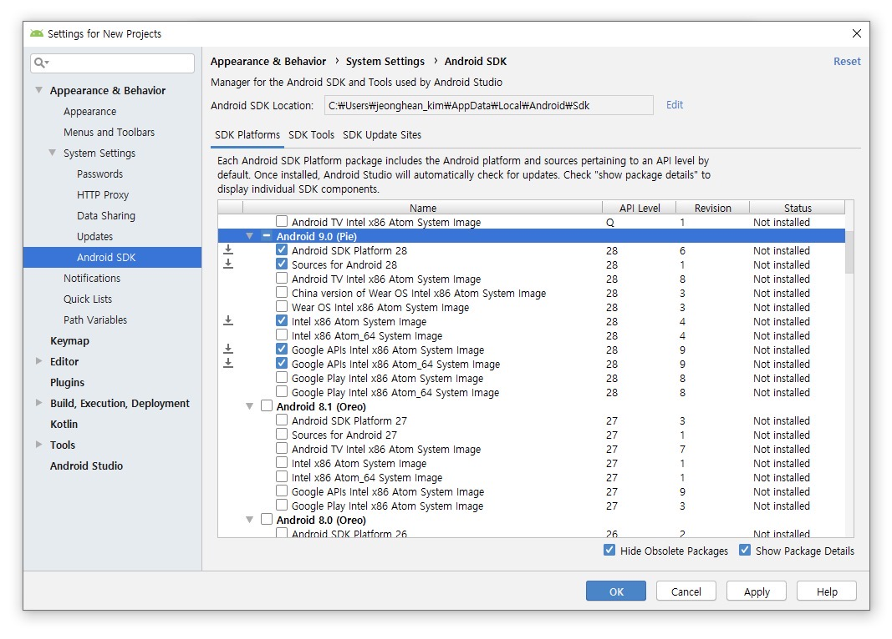

When you can see the screen like above, insert platform-tools folder paht in Android SDK path like `C:\Users\[user name]\AppData\Local\Android\Sdk\platform-tools` to the bottom of the list and click OK button.

After that, open Command Prompt(cmd) and execute the command below.

```
adb
```

If the environment variables are configured well, you can see the result like below.

>
>
> ```
> Android Debug Bridge version 1.0.41
> Version 29.0.1-5644136
> Installed as /Users/jeonghean_kim/Library/Android/sdk/platform-tools/adb
> ```

### Create & Check react-native Project <a href="#create--check-react-native-project" id="create--check-react-native-project"></a>

Execute React Native CLI command below to create react-native project.

```
npx react-native init WandieDemoApp
```

#### Check on Android <a href="#check-on-android" id="check-on-android"></a>

In Android, execute the command below after connecting the device that the developer mode is activated via USB or executing Android studio emulator.

```
cd SampleApp
# react-native run-android
npm run android
```

If you don’t have any problen, you can see the screen like below.

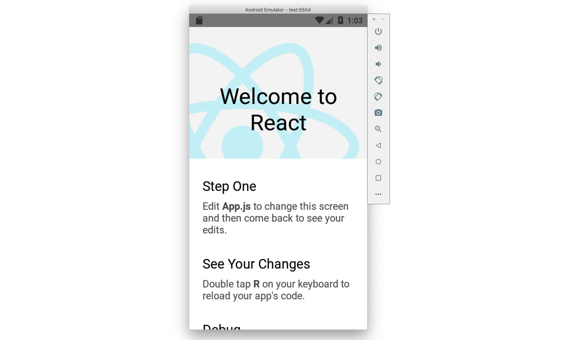

We’ve seen how to install and configure react-native to develop the app on Windows. Also, We’ve created the app by React Native CLI and executed it to check the environment is configured well.

Now, we are ready to develop the app with react-native. Let’s dive to the react-native development world!

CREDITS : [https://dev-yakuza.posstree.com/en/react-native/install-on-windows/](https://dev-yakuza.posstree.com/en/react-native/install-on-windows/)


